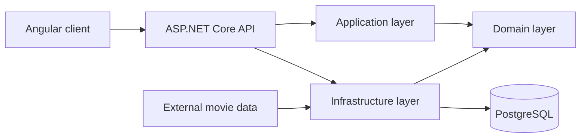

<div align="center">

# AfterFrame

### Remember what stayed with you after the credits rolled.

<p>
  
  
  
  
</p>

</div>

---

AfterFrame is a personal film and series journal for everything that stays with you after the credits roll.

Most catalogs are good at telling you what exists. AfterFrame also remembers what it meant to you: what you watched, where you stopped, how you rated it, and what you wanted to say about it afterwards.

A title can belong to a shared catalog while still being part of a completely personal story.

## What you can do

| Explore | Remember |
| --- | --- |
| Browse movies, series, animation, and anime | Build your personal watch library |
| Open detailed title, cast, and crew pages | Track planned, watching, completed, on-hold, and dropped titles |
| Discover titles imported from external databases | Rate titles on a ten-star scale with half-star precision |
| Add titles that are missing from the catalog | Write and edit personal reviews |
| Submit user-created titles for moderation | Remember the last watched season and episode |
| Search and filter the shared catalog | Build a personal ranking from your ratings |

User-created titles remain private until they are submitted for review and accepted into the shared catalog.

## How it fits together



## Technology

- **Angular** and **TypeScript** for the client application
- **ASP.NET Core** for the HTTP API
- **Entity Framework Core** for persistence
- **PostgreSQL** for application data
- **Docker Compose** for the local database environment

## Repository structure

```text
AfterFrame/
├── frontend/   Angular client application
└── backend/
    ├── src/
    │   ├── AfterFrame.Api/
    │   ├── AfterFrame.Application/
    │   ├── AfterFrame.Domain/
    │   └── AfterFrame.Infrastructure/
    └── compose.yaml
```

The frontend is organized by product features. The backend keeps domain rules, use cases, infrastructure, and HTTP concerns in separate layers.
